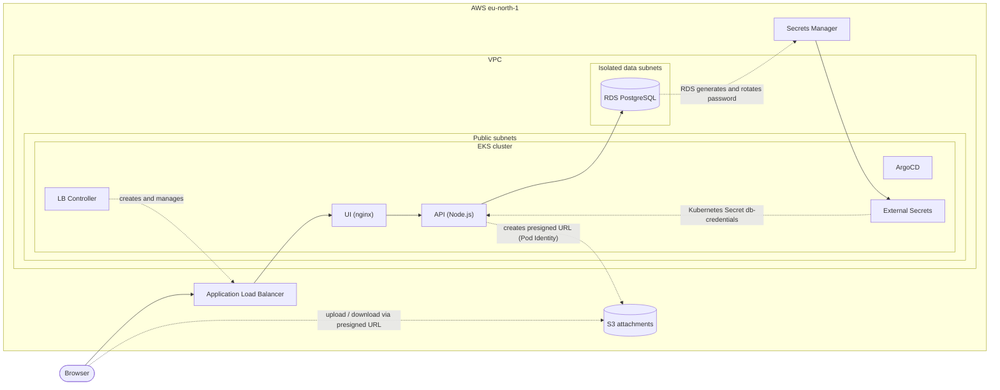
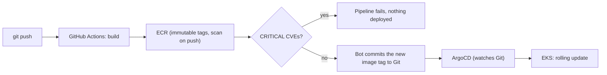

# aws-eks-gitops-platform

A small task manager (React UI, Node.js API, PostgreSQL, file attachments) built as a
vehicle for practising DevOps end to end: **Terraform**, **EKS**, **GitOps with ArgoCD**,
a **CI pipeline with a security gate**, and **secrets that live only in AWS**.

The whole AWS environment is created and destroyed from code. A session costs about
**$0.35 per hour**, so you build it when you practise and destroy it when you are done.

- [How it works](#how-it-works)
- [What you do by hand, and what runs by itself](#what-you-do-by-hand-and-what-runs-by-itself)
- [One-time setup (manual)](#one-time-setup-manual)
- [Every session: build, use, destroy](#every-session-build-use-destroy)
- [What Terraform builds](#what-terraform-builds)
- [CI/CD](#cicd)
- [Local development (kind)](#local-development-kind)
- [Cost and guard rails](#cost-and-guard-rails)
- [Design decisions and constraints](#design-decisions-and-constraints)
- [Known limitations and roadmap](#known-limitations-and-roadmap)
- [Troubleshooting](#troubleshooting)
- [Repository layout](#repository-layout)

---

## How it works

**What runs in AWS** (`eu-north-1`):



**How a code change reaches the cluster** (CI never touches the cluster; it only changes Git):



**Where each kind of secret lives**

| Secret | Where | How it is used |
|---|---|---|
| Database password | Secrets Manager, **generated by RDS itself** | External Secrets copies it into the Kubernetes Secret `db-credentials`. It never passes through Terraform, Git, or a human. |
| API access to S3 | **No secret.** EKS Pod Identity gives the pod a temporary IAM role | The API signs short-lived upload and download URLs. |
| CI access to ECR | GitHub Actions secrets (one IAM user that can only push to two ECR repositories) | The only long-lived credential in the project. Rotate it. |
| Your admin access | `aws configure` on your own machine | One access key per machine. |

---

## What you do by hand, and what runs by itself

| | Manual (you) | Automatic |
|---|---|---|
| **Once per AWS account** | Create the account and an admin user, create the state bucket, run `terraform apply` in `infra/global`, create the CI access key and add it to GitHub | |
| **Once per machine** | Install the tools, run `aws configure` | |
| **Code change** | `git push` | CI builds, scans, pushes images to ECR, commits the new tag; ArgoCD rolls it out |
| **Every session: build** | `git pull`, then `bash scripts/eks-up.sh` and type `yes` | VPC, EKS, RDS, S3, IAM, controllers, ArgoCD, and the app (about 20 minutes) |
| **Every session: destroy** | `bash scripts/eks-down.sh` and type `yes` | Removes the ALB first, then everything else, then checks for leftovers (about 15 minutes) |

The rule that matters: **always tear down with `eks-down.sh`, never a bare `terraform destroy`**
(see [why](#design-decisions-and-constraints)).

---

## One-time setup (manual)

### Prerequisites on every machine

| Tool | Notes |
|---|---|
| `git` | |
| `aws` CLI v2 | Required even though Terraform does the work: Terraform calls `aws eks get-token` to log in to the cluster |
| `terraform` 1.10 or newer | Needed for S3-native state locking (`use_lockfile`). Check with `terraform -version`; an old copy earlier on your `PATH` is a common trap |
| `kubectl` | To look at the cluster |

You do **not** need Docker or Helm for the AWS environment. The scripts are bash: macOS, Linux, or WSL.

### 1. AWS account

1. Use a **paid plan**. This project was built on an account that was upgraded from the Free plan before anything was
   created, so it has **not been tested on the Free plan**. Free-plan accounts have extra service restrictions and
   credit-based limits, so upgrading is the safe choice.
2. Turn on MFA for your login.
3. Set a **monthly spend limit** (Billing, Spend limit; the minimum is $20) and a **budget alert**.
4. This account's organization policy (SCP) only allows the **`eu-north-1`** region. Use it for everything.
5. Create an IAM user for yourself (this project calls it `terraform-admin`) with `AdministratorAccess`,
   then create an access key for it (IAM, Users, Security credentials, Create access key, CLI).

### 2. Configure the AWS CLI

```bash
aws configure
```

Enter the key, the secret, region `eu-north-1`, and output format `json` (**lowercase**).
Say `n` if it offers to configure "AWS skills and the MCP server". Then check:

```bash
aws sts get-caller-identity
```

### 3. Create the Terraform state bucket

Terraform cannot create the bucket that holds its own state, so this one is manual.
Replace `<ACCOUNT_ID>` with your 12-digit account number:

```bash
aws s3api create-bucket --bucket tfstate-<ACCOUNT_ID> --region eu-north-1 \
  --create-bucket-configuration LocationConstraint=eu-north-1
aws s3api put-bucket-versioning --bucket tfstate-<ACCOUNT_ID> \
  --versioning-configuration Status=Enabled
aws s3api put-public-access-block --bucket tfstate-<ACCOUNT_ID> \
  --public-access-block-configuration BlockPublicAcls=true,IgnorePublicAcls=true,BlockPublicPolicy=true,RestrictPublicBuckets=true
```

> **Using a different AWS account?** The account ID is written into a few files. Find them all:
>
> ```bash
> grep -rn "508193318669" --include=*.tf --include=*.yml --include=*.yaml .
> ```
>
> Replace it in `infra/global/versions.tf`, `infra/dev/versions.tf` (the bucket name),
> `.github/workflows/app-ci.yml` (`ECR_REGISTRY`), and the two image `repository:` lines in
> `gitops/envs/eks-dev/tasks.yaml`. Also change `gitops_repo_url` in `infra/dev/variables.tf`
> if you forked the repo.

### 4. Create the persistent layer (`infra/global`)

This creates the two ECR repositories (immutable tags, scan on push, keep the newest 10 images)
and the CI IAM user. It costs a few cents a month and is **not** destroyed between sessions.

```bash
cd infra/global
terraform init
terraform plan -out tfplan
terraform apply tfplan
cd ../..
```

### 5. Give GitHub the CI credentials

Terraform deliberately does not create this access key, because a key created by Terraform would be
stored in plain text in the state file.

```bash
aws iam create-access-key --user-name aws-eks-gitops-platform-github-ci
```

In GitHub, open **Settings, Secrets and variables, Actions** and add two repository secrets:
`AWS_ACCESS_KEY_ID` (the `AccessKeyId`) and `AWS_SECRET_ACCESS_KEY` (the `SecretAccessKey`).
Then clear your terminal. The secret is shown only once.

### 6. Publish the first images

Push to `main` (or open **Actions, app-ci, Run workflow**). CI builds both images, pushes them to ECR,
checks the security scan, and commits the real image tags into `gitops/envs/eks-dev/tasks.yaml`.
Until that has happened the file says `tag: "initial"`, and `eks-up.sh` will refuse to run.

```bash
git pull
grep tag gitops/envs/eks-dev/tasks.yaml     # should show two long commit SHAs
```

> **Always `git pull` before you start working.** The CI bot commits to `main`, so your local copy
> falls behind.

### 7. Optional: check what the account allows

If the account has an organization policy (this one blocks spot instances, OIDC providers, and other
regions), this script tests what is blocked using only free calls:

```bash
bash scripts/preflight-aws.sh
```

---

## Every session: build, use, destroy

### Build

```bash
git pull
bash scripts/eks-up.sh
```

Type `yes` when Terraform asks. Keep the terminal open and the machine awake
(`caffeinate -i` in a second terminal on macOS). Anything you add is passed to `terraform apply`,
for example `bash scripts/eks-up.sh -var node_desired_size=1` for a cheaper one-node run.

**What happens (about 20 minutes, and the cost clock starts when the cluster appears):**

| Time | What is built |
|---|---|
| 0 to 2 min | Checks your AWS login and that CI has published real image tags. VPC, subnets, IAM roles, security groups |
| 2 to 10 min | EKS control plane. **RDS** is created in parallel |
| 10 to 14 min | Two worker nodes, then the cluster add-ons |
| 14 to 22 min | Helm releases, one after another: load balancer controller, then metrics-server, External Secrets, and ArgoCD, then the database secret and the app definition |
| 22 to 27 min | ArgoCD syncs the app from Git. The load balancer controller creates the ALB. The script waits for the ALB address and prints the app URL |

A brand-new ALB can answer with 503 for another minute or two while it registers targets.

### Use it

```bash
kubectl get nodes
kubectl get applications -n argocd        # tasks: Synced, Healthy
kubectl get pods -n tasks                 # API and UI Running. There is no Postgres pod: the database is RDS
kubectl get externalsecret -n tasks       # SecretSynced: the RDS password reached Kubernetes
kubectl get ingress -n tasks              # the ALB hostname is your app's URL
```

ArgoCD's UI:

```bash
kubectl -n argocd get secret argocd-initial-admin-secret -o jsonpath='{.data.password}' | base64 -d
kubectl port-forward -n argocd svc/argocd-server 8443:443
```

Then open https://localhost:8443 (user `admin`) and accept the certificate warning.

**A quick end-to-end check:**

| Check | Command or action | Pass means |
|---|---|---|
| App works | Open the ALB URL, add a task | The UI, API, and RDS all work |
| Attachments | Attach a file, click **Open file**, then `aws s3 ls s3://<project>-dev-attachments-<ACCOUNT_ID>/ --recursive` | Pod Identity, presigned URLs, and CORS work |
| Data survives | `kubectl delete pod -n tasks -l app=api`, then refresh | Data lives in RDS and S3, not in pods |
| Autoscaling | `kubectl get hpa -n tasks` | A real percentage (not `<unknown>`) after a minute or two |
| Policies enforced | `kubectl run netcheck -n tasks --rm -it --image=public.ecr.aws/docker/library/busybox:1.36 --restart=Never -- wget -qO- -T 3 http://api:3000/healthz` | **Times out**: only the UI may reach the API |

### Destroy

```bash
bash scripts/eks-down.sh
```

Type `yes` when asked. It takes about 15 minutes and does this, in order:

1. Deletes the ArgoCD applications, which makes Kubernetes remove the **ALB** and its security groups.
2. Deletes any remaining PersistentVolumeClaims, which releases their EBS disks.
3. Waits until no load balancer is left in the VPC.
4. Runs `terraform destroy`.
5. Prints a **leftovers check**. Every list (clusters, RDS, load balancers, volumes, instances, buckets)
   should be empty.

Then remove the stale kubeconfig entry:

```bash
kubectl config delete-context arn:aws:eks:eu-north-1:<ACCOUNT_ID>:cluster/aws-eks-gitops-platform-dev
```

**What survives a destroy, and what does not**

| Kept (so the next build is fast) | Destroyed (each build starts empty) |
|---|---|
| State bucket, ECR repositories and their images, the CI IAM user and GitHub secrets, image tags in Git | The cluster, nodes, VPC, ALB, **RDS database and its data**, the attachments bucket and its files |

### Building from another machine

Install the [prerequisites](#prerequisites-on-every-machine), run `aws configure` with that machine's own
access key, `git clone`, and `bash scripts/eks-up.sh`. Everything else is in Git or in the S3 state bucket.

---

## What Terraform builds

Everything below is in `infra/dev` and is created by `eks-up.sh`.

| Area | Resources |
|---|---|
| **Network** (`infra/modules/vpc`) | VPC, internet gateway, 2 public subnets (nodes and ALB), 2 isolated data subnets (RDS) with **no route to the internet**. No NAT gateway |
| **Cluster** | EKS 1.36, one managed node group (2 x `t3.large`, on-demand), add-ons: VPC CNI (with network policy enforcement on), CoreDNS, kube-proxy, Pod Identity agent, EBS CSI driver. Control-plane logs go to CloudWatch (7 days) |
| **Database** | RDS PostgreSQL 16 (`db.t4g.micro`) in the data subnets. Reachable only from the worker nodes' security group. The master password is generated and managed by RDS in Secrets Manager. Logs go to CloudWatch |
| **Storage** | A private, encrypted S3 bucket for attachments, with CORS so browsers can upload and download with presigned URLs |
| **IAM** | Pod Identity roles for the API (S3 access to one bucket), External Secrets (read one secret), the load balancer controller, and the EBS CSI driver |
| **In-cluster** (Helm, installed by Terraform) | AWS Load Balancer Controller, metrics-server, External Secrets Operator, ArgoCD, the `db-secret` chart (the ExternalSecret that copies the RDS password), and the ArgoCD Application for the app |

**Variables you may want to change** (`infra/dev/variables.tf`):

| Variable | Default | Notes |
|---|---|---|
| `node_desired_size` | `2` | `1` is enough for a quick test, but the full stack needs 2 |
| `node_instance_types` | `["t3.large"]` | `t3.medium` runs out of pod slots (about 17 per node) |
| `node_capacity_type` | `ON_DEMAND` | `SPOT` is blocked by this account's organization policy |
| `kubernetes_version` | `1.36` | One behind the newest at the time of writing |
| `enable_network_policy` | `true` | Set `false` only to diagnose a networking problem |
| `rds_storage_encrypted` | `true` | Set `false` only if the organization policy blocks the AWS-managed key |

### How ArgoCD gets its configuration

The app's Helm values come from four layers. Later layers win:

1. `charts/tasks/values.yaml`: chart defaults.
2. `gitops/envs/eks-dev/config.yaml`: settings maintained **by hand** (ALB annotations, TLS to the database).
3. `gitops/envs/eks-dev/tasks.yaml`: image tags, written **only by the CI bot**.
4. Values that only exist once the infrastructure does (database host, bucket name, VPC CIDR, region),
   **injected by Terraform** into the ArgoCD Application.

Keeping the CI-owned file separate from the hand-written one means the bot and you never edit the same file.

---

## CI/CD

Two GitHub Actions workflows in `.github/workflows/`:

**`app-ci.yml`** runs when anything under `apps/` changes.

| Event | What it does |
|---|---|
| Pull request | Builds both images, to prove they compile. Nothing is published and no AWS access is used |
| Push to `main` | Builds both images, pushes them to ECR tagged with the **commit SHA**, then runs the **security gate**. If either image has a CRITICAL vulnerability, the pipeline fails and lists the CVEs. If both pass, a bot commits the new tags to `gitops/envs/eks-dev/tasks.yaml` |

**`validate.yml`** runs when `charts/`, `gitops/`, or `infra/` change. It runs `helm lint` against **every**
environment's values, and `terraform fmt -check` and `terraform validate` on every Terraform folder.
It needs no AWS access, so it also runs on pull requests.

**Required GitHub secrets:** `AWS_ACCESS_KEY_ID` and `AWS_SECRET_ACCESS_KEY` (see
[step 5](#5-give-github-the-ci-credentials)).

---

## Local development (kind)

The same Helm chart also runs on a free local cluster, with in-cluster Postgres and a full
Prometheus and Grafana stack deployed by ArgoCD. The local scripts are **PowerShell** (written on Windows;
`pwsh` on macOS or Linux also works).

**Needs:** Docker Desktop (on Windows, with WSL2 on **cgroup v2**, see [troubleshooting](#troubleshooting)),
`kind`, `kubectl`, `helm`, the `aws` CLI, and a local database password in Secrets Manager:

```bash
pw=$(aws secretsmanager get-random-password --password-length 24 --exclude-punctuation --query RandomPassword --output text)
aws secretsmanager create-secret --name aws-eks-gitops-platform/local/db-password --secret-string "$pw"
```

| Goal | Command |
|---|---|
| App and database only, with Docker Compose | `. .\scripts\local-env.ps1` then `docker compose up --build`, then http://localhost:8080 |
| Full local cluster: kind, Traefik, ArgoCD, Prometheus, Grafana | `.\scripts\kind-up.ps1`, then http://localhost:8088 |
| Grafana and Prometheus | http://grafana.localhost:8088 and http://prometheus.localhost:8088 |
| Delete the local cluster | `.\scripts\kind-down.ps1` |

`kind-up.ps1` creates the Grafana admin password in Secrets Manager on its first run.
The local cluster is deployed by ArgoCD **from GitHub**, so changes must be pushed before they show up there.
Keep local experiments small: the full stack uses several GB of RAM.

---

## Cost and guard rails

**While the AWS environment is running** (prices change; check the current pricing pages):

| Item | About |
|---|---|
| EKS control plane | $0.10 per hour |
| 2 x `t3.large` on-demand | $0.18 per hour |
| RDS `db.t4g.micro`, ALB, public IPv4 addresses | $0.07 per hour |
| **Total** | **about $0.35 per hour**, or about $8 for every day you forget it running |

**While nothing is running:** about $1 a month (two local Secrets Manager secrets at $0.40 each, plus
cents for ECR and S3).

**Guard rails**

- The account's **monthly spend limit** pauses the project if something runs away, and a budget alert emails you early.
- `eks-up.sh` refuses to start if CI has not published real image tags.
- `eks-down.sh` removes what Terraform cannot see, and **ends with a leftovers check**.
- Control-plane and database logs expire after 7 days.

---

## Design decisions and constraints

| Decision | Why |
|---|---|
| **Pod Identity instead of IRSA** | The account's organization policy denies creating IAM OIDC providers, and IRSA needs one. The EKS module's `enable_irsa` defaults to `true`, so it is explicitly set to `false` |
| **A least-privilege IAM user for CI instead of keyless OIDC** | The same policy blocks the GitHub OIDC provider. The user can only push to two ECR repositories, and its key is created by hand so it never lands in Terraform state |
| **RDS-managed password, copied by External Secrets** | The password never appears in Terraform state, Git, or a terminal. The API keeps reading plain environment variables, so it stays portable |
| **No NAT gateway** | It costs about $33 a month even when idle. Nodes get public IPs and are protected by security groups with no inbound access from the internet. In production you would use private subnets with NAT or VPC endpoints |
| **Isolated data subnets** | The database has no route to the internet in either direction |
| **On-demand nodes** | Spot instances are blocked by the organization policy |
| **Terraform hands infrastructure-derived values to ArgoCD** | The database host and bucket name do not exist until Terraform creates them, so they cannot be committed to Git in advance |
| **`eks-down.sh` instead of a bare `terraform destroy`** | The ALB, its security groups, and any EBS disks are created by **Kubernetes**, so Terraform does not know about them. Destroying the cluster first would orphan them: they would keep billing, and their network interfaces would block the VPC from being deleted |
| **Immutable ECR tags, tagged with the commit SHA** | A tag always means the same image, and every deployed version traces back to a commit |
| **A security gate that blocks on CRITICAL CVEs** | Old base images collect vulnerabilities over time. Fix the image; do not lower the gate |
| **`NetworkPolicy` enforcement turned on in the VPC CNI** | Without it the policies in the chart are accepted but never enforced on EKS. The ALB's traffic arrives from VPC IPs, so the UI policy allows the VPC CIDR |
| **Liveness and readiness probes are different on purpose** | Liveness must never depend on the database, or a database outage restarts every API pod. Only readiness checks the database |

---

## Known limitations and roadmap

**Limitations of the current build**

- **HTTP only.** The ALB has no domain or certificate.
- The Kubernetes API endpoint is **public** (open to `0.0.0.0/0`, but every request needs valid AWS IAM credentials).
  Restrict it with `api_allowed_cidrs` if you want.
- The **database password rotates** (RDS rotates it about every 7 days). External Secrets refreshes the
  Kubernetes Secret, but running API pods keep the old password until restarted. That is irrelevant for
  hour-long sessions, but a long-lived environment would need a tool that restarts pods on secret changes.
- The **attachments bucket allows any CORS origin**, because the ALB hostname is not known in advance.
  The presigned URL is the real authorization.
- The database is single-AZ with `skip_final_snapshot`. These are lab settings.

**Not built yet**

- Prometheus and Grafana **on EKS**. The chart already contains the ServiceMonitor, alert rules, and the
  Grafana dashboard, and the stack runs on kind. It still needs wiring up for EKS with `gp3` volumes.
- A **logging stack** (Fluent Bit, Elasticsearch, Kibana) and **CloudWatch alarms**.
- **HTTPS and a custom domain** (ACM certificate and Route 53).
- An **ops VM** configured with Ansible for load tests.

---

## Troubleshooting

| Symptom | Cause and fix |
|---|---|
| `terraform plan`: `chart "..." version "..." not found in ... repository` | The chart was published minutes ago and the Helm repository website has not caught up. Check with `curl -s <repo>/index.yaml`, and pin the newest version it serves |
| CI fails at **Security gate** and lists CVEs | The base image has CRITICAL vulnerabilities. Bump the base image in the Dockerfile |
| CI: `ScanNotFoundException` | ECR starts the scan a few seconds after the push. The gate polls for it |
| `eks-up.sh`: "still has the placeholder tag 'initial'" | CI has not published images yet. Wait for **app-ci** to finish, then `git pull` |
| `git push` is rejected | The CI bot committed to `main`. Run `git pull` first |
| App pods in `CreateContainerConfigError` right after a build | The database Secret has not been copied yet. External Secrets syncs it a minute or two after RDS finishes |
| ALB returns 503 or 504 | A new ALB takes a minute or two to register targets. If it persists, test with `-var enable_network_policy=false` to rule out the network policies |
| `terraform destroy` fails on the VPC with `DependencyViolation` | An ALB or network interface still exists. Use `eks-down.sh`, and check `aws elbv2 describe-load-balancers` |
| `aws`: `NoRegion` | `aws configure set region eu-north-1` |
| zsh treats `#` comments as arguments | `echo 'setopt interactive_comments' >> ~/.zshrc && source ~/.zshrc` |
| `terraform -version` shows an old version | An older copy is earlier on your `PATH`. Find it with `where terraform` (Windows) or `which -a terraform` and remove it |
| Windows: `kind create cluster` fails with `kubeadm init` errors | WSL2 is on cgroup v1. Update WSL and add `kernelCommandLine = cgroup_no_v1=all` under `[wsl2]` in `%USERPROFILE%\.wslconfig` |
| Local port 80 returns a stray 404 | Something else owns port 80. The kind cluster uses port **8088** for this reason |
| PowerShell: "script is not digitally signed" | `Set-ExecutionPolicy -Scope CurrentUser RemoteSigned`, then `Get-ChildItem -Recurse -File | Unblock-File` |

---

## Repository layout

```
.
├── apps/
│   ├── api/                  Node.js API (tasks, probes, Prometheus metrics, S3 presigned URLs)
│   └── ui/                   React UI served by nginx (unprivileged, alpine-slim)
├── charts/
│   ├── tasks/                Helm chart for the app (UI, API, optional Postgres, policies, monitoring)
│   └── db-secret/            ExternalSecret that copies the RDS password into Kubernetes
├── gitops/
│   ├── bootstrap/            ArgoCD root application for kind
│   ├── apps/kind/            ArgoCD applications for kind (app, monitoring)
│   └── envs/
│       ├── kind/             Values for the local cluster
│       └── eks-dev/          config.yaml (by hand) and tasks.yaml (written by CI)
├── infra/
│   ├── global/               Persistent layer: ECR repositories, CI IAM user
│   ├── dev/                  Ephemeral layer: VPC, EKS, RDS, S3, IAM, Helm releases
│   └── modules/vpc/          Hand-written VPC module
├── k8s/kind-config.yaml      Local kind cluster definition
├── scripts/
│   ├── eks-up.sh             Build the AWS environment
│   ├── eks-down.sh           Tear it down safely, then check for leftovers
│   ├── preflight-aws.sh      Free checks of what the AWS account allows
│   ├── kind-up.ps1           Local cluster (PowerShell)
│   ├── kind-down.ps1
│   └── local-env.ps1         Loads the local DB password from Secrets Manager
├── docker-compose.yml        App and database, no Kubernetes
└── .github/workflows/        app-ci.yml and validate.yml
```